## 🚀 Skincare AI — AI-Powered Personalized Skincare Recommendation System

### 📘 Project Overview

**Skincare AI** is an intelligent, full-stack skincare recommendation platform that leverages AI-driven models to analyze user skin profiles and suggest tailored skincare routines.

It integrates a seamless frontend wizard for users to input their details, a Node.js backend for API and authentication management, and a Python-based AI engine for machine learning–powered product recommendations.

💡 **Goal:** Empower users with AI-generated personalized skincare plans based on skin type, age, concerns, and sensitivity levels.

---

### 🧩 Key Features

| Feature                  | Description                                          |
| ------------------------ | ---------------------------------------------------- |
| 👤 User Authentication   | Secure login/register using JWT                      |
| 🪞 Recommendation Wizard | Multi-step questionnaire for skincare profile        |
| 🤖 AI-Powered Prediction | Uses ML model to suggest personalized routines       |
| 📊 User Dashboard        | Displays stats, past recommendations, and analytics  |
| 🔐 Admin Dashboard       | Manage users, track activity, and delete data safely |
| 🧠 Analytics Integration | Computes averages and user activity statistics       |

---

### 🧠 Architecture Overview

**Core Components:**

| Layer        | Technology                     | Role                                               |
| ------------ | ------------------------------ | -------------------------------------------------- |
| 🖥️ Frontend  | React (Vite)                   | User interaction, Dashboard, Recommendation Wizard |
| ⚙️ Backend   | Node.js (Express + Prisma ORM) | RESTful APIs, Authentication, CRUD operations      |
| 🤖 AI Engine | Python (scikit-learn)          | Model prediction for skincare products             |
| 💾 Database  | SQLite + Prisma                | User and recommendation data persistence           |

**Flow Summary:**\
Frontend → Backend (API + JWT Auth) → AI Engine (Model Prediction) → Database → Dashboard Display

---

### ⚙️ Tech Stack

| Category  | Technology                                |
| --------- | ----------------------------------------- |
| Frontend  | React (Vite), Tailwind CSS, Axios         |
| Backend   | Node.js, Express, Prisma ORM, bcrypt, JWT |
| AI Engine | Python, scikit-learn, pandas, numpy       |
| Database  | SQLite (Development), Prisma Client ORM   |
| Tools     | VS Code, Postman, Git, Vite Dev Server    |

---

### 📂 Folder Structure

```
skincare-ai/
├── backend/
│   ├── controllers/
│   ├── services/
│   ├── routes/
│   ├── prisma/
│   │   ├── schema.prisma
│   ├── ai_model.py
│   ├── makeAdmin.js
│   └── server.js
│
├── frontend/
│   ├── src/
│   │   ├── pages/
│   │   ├── components/
│   │   ├── services/
│   │   ├── App.jsx
│   │   └── main.jsx
│   └── vite.config.js
│
├── database/
│   └── SQLite.db
└── README.md
```

---

### ⚙️ Environment Variables Setup

Create a `.env` file inside the **backend** folder and configure the following:

```env
# Database URL
DATABASE_URL="file:./dev.db"

# JWT Secret Key
JWT_SECRET="your-jwt-secret-key"

# Encryption Key for Recommendations
ENCRYPTION_KEY="32-char-long-encryption-key"

# Path for Python Script
PYTHON_SCRIPT_PATH="./ai_model.py"
```

Ensure the `ENCRYPTION_KEY` is **exactly 32 characters long** for AES-256 encryption to function properly.

---

### ⚙️ Python Requirements

Create a `requirements.txt` file inside the **backend** directory for Python dependencies:

```txt
scikit-learn==1.5.1
pandas==2.2.2
numpy==1.26.4
```

Install dependencies:

```bash
pip install -r requirements.txt
```

---

### 🚀 Setup & Run Instructions

#### 1️⃣ Backend Setup

```bash
cd backend
npm install
npx prisma migrate dev --name init
node makeAdmin.js
npm run dev
```

#### 2️⃣ Frontend Setup

```bash
cd frontend
npm install
npm run dev
```

#### 3️⃣ AI Engine Setup

```bash
cd backend
python ai_model.py
```

✅ The system runs on **http\://localhost:3000**

---

### 🔒 Authentication Flow

1️⃣ User registers or logs in → Backend generates JWT.\
2️⃣ JWT is stored in localStorage for secure sessions.\
3️⃣ Every protected API call includes JWT in headers.\
4️⃣ Admin has elevated privileges to manage users and recommendations.

---

### 🧠 AI Engine (Python Integration)

- **Script:** `ai_model.py`
- **Model:** scikit-learn classifier trained on skin-type, sensitivity, and concern dataset.
- **Process:**
  1. Backend spawns Python process via child_process.
  2. User inputs → fed to ML model → generates recommendation.
  3. Result saved in database and displayed in frontend.

---

### 📸 Screenshots Gallery

#### 💻 Login Page

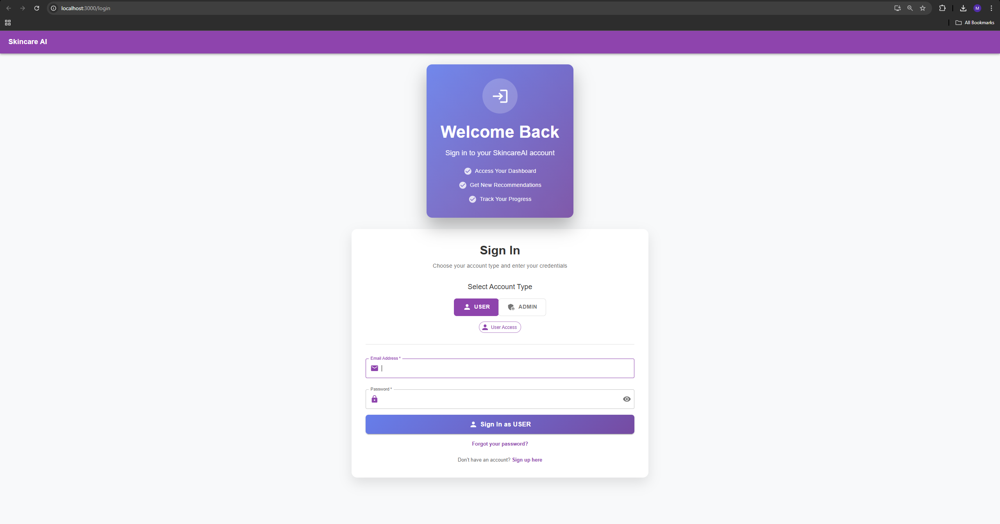

#### 🧍 Register Page

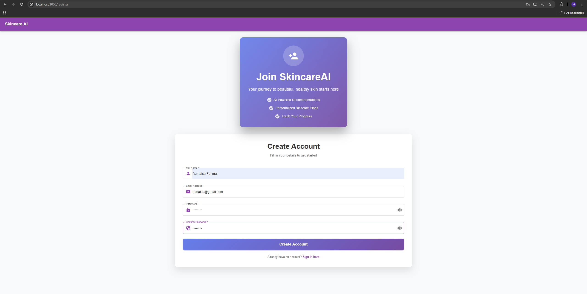

#### 🧭 User Dashboard

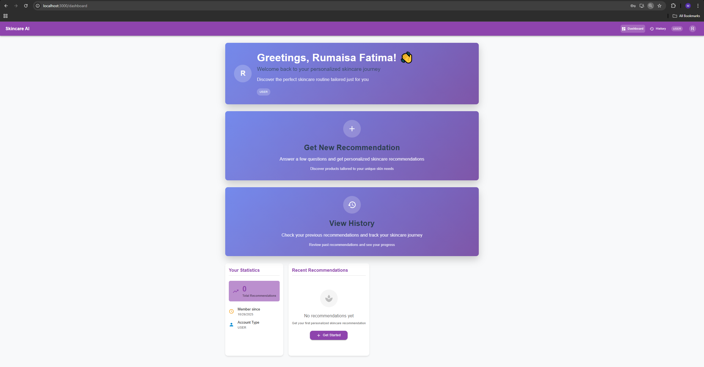

#### 🌼 Wizard Step 1

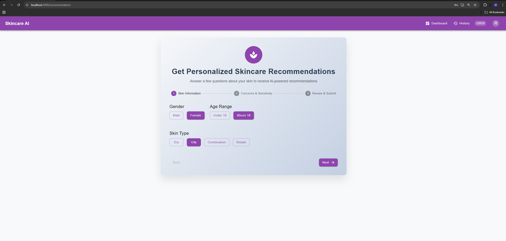

#### 🌸 Wizard Step 2

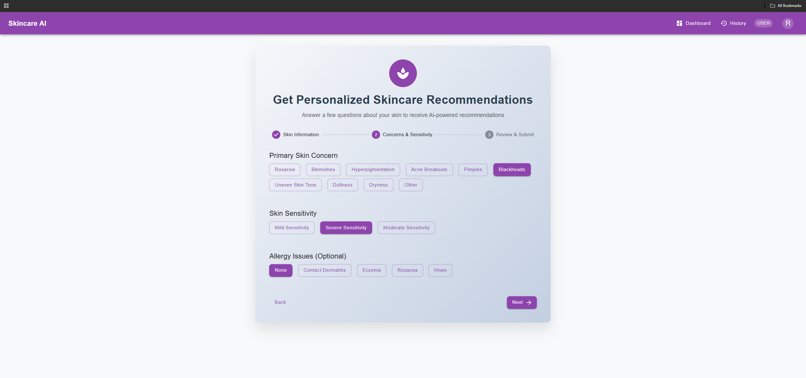

#### 🌼 Wizard Step 3


#### ✅ Success Screen

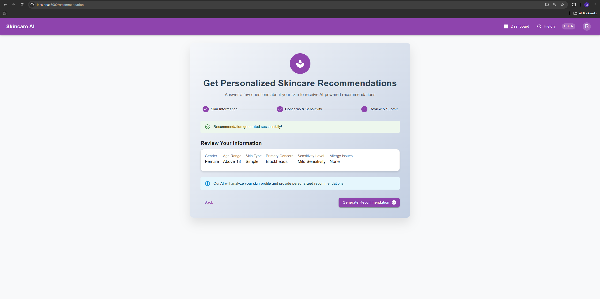

#### 📖 Skincare History

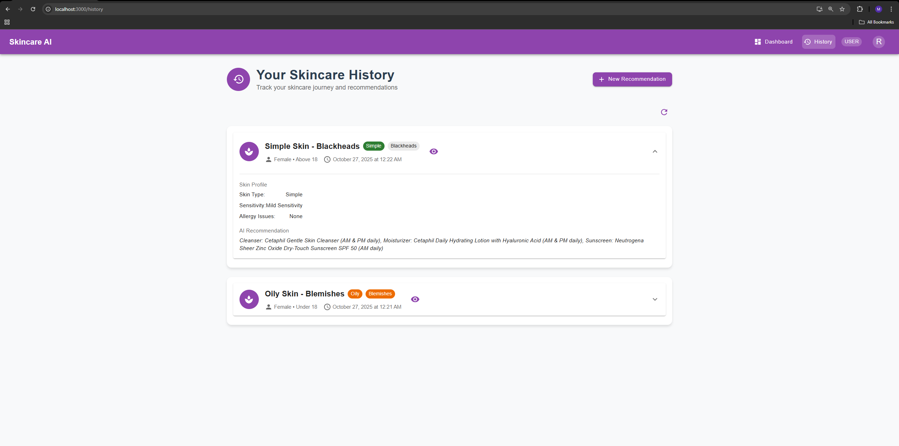

#### 🔍 View Recommendation

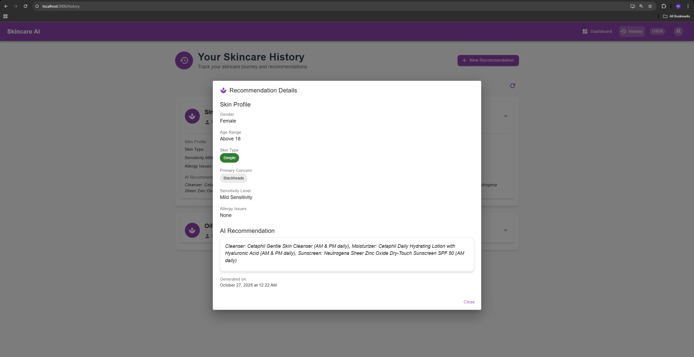

#### 📊 User Dashboard Stats

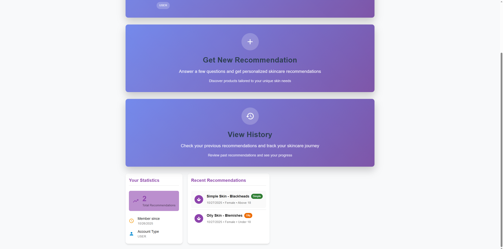

#### 🧩 Admin Dashboard

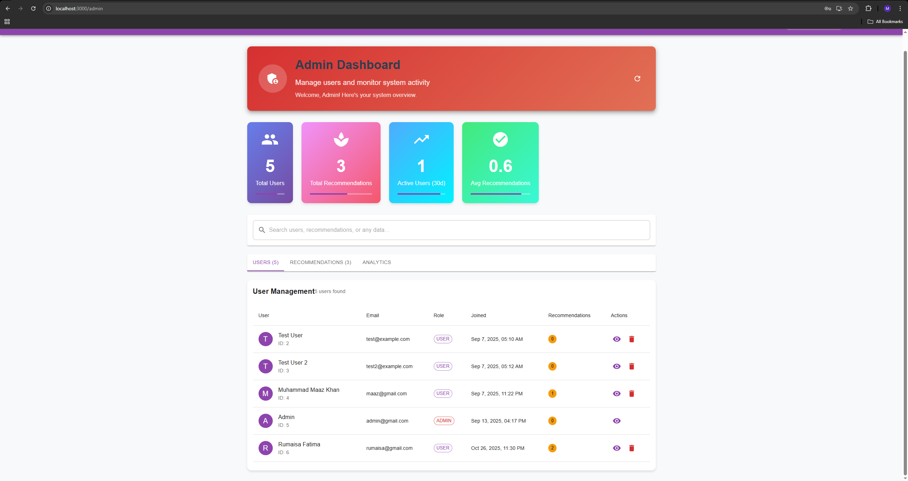

#### 🗑️ Admin Delete Recommendation

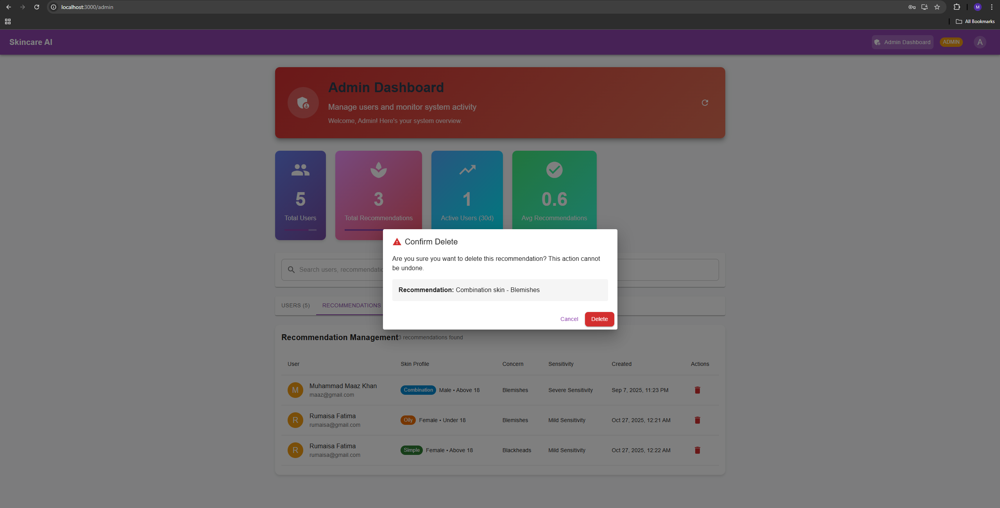

#### ❌ Admin Delete User

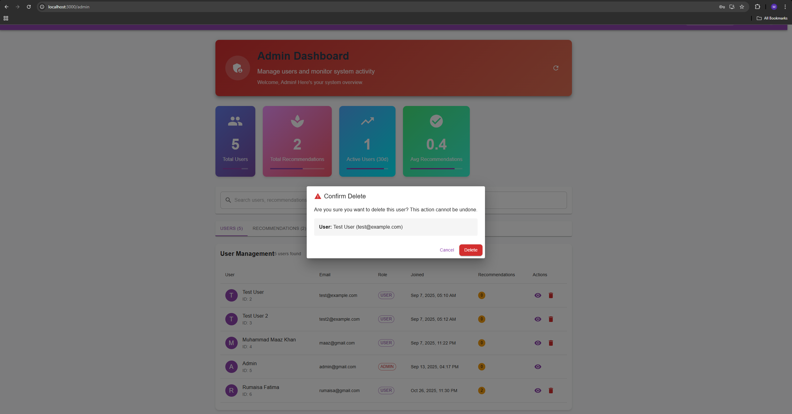

---

### 🌱 Future Enhancements

- 🧬 Migrate model to TensorFlow for deeper learning.
- ☁️ Integrate cloud database (PostgreSQL / MongoDB Atlas).
- 📊 Add analytics dashboard for recommendation insights.
- 🧴 Expand ML dataset for broader skincare profiles.
- 🔔 Add email notifications for users.
